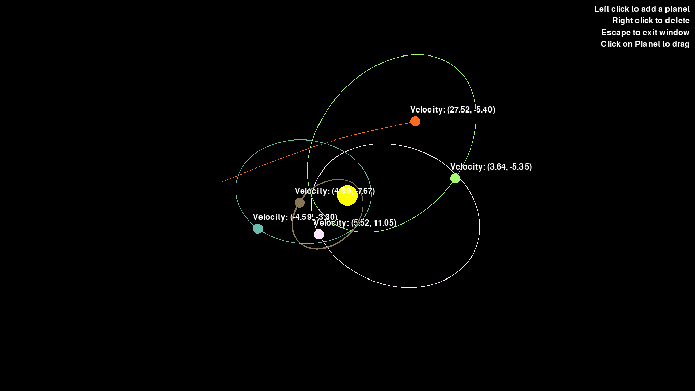

# Planet and Star Simulation

A simple Pygame simulation of planets orbiting around a star with gravitational interactions.

## Table of Contents

- [Features](#features)
- [Installation](#installation)

## Features

- Simulates gravitational interactions between a star and planets.
- Planets can be added, deleted, and dragged interactively.
- Realistic physics simulation with elliptical orbits.
- User interface with basic instructions.

## Installation

1. Ensure you have Python and Pygame installed.

